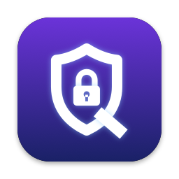

<p align="center"></p>

<h1 align="center">QGuard</h1>

<p align="center"><b>Stop <kbd>⌘</kbd><kbd>⇧</kbd><kbd>Q</kbd> from logging you out of macOS, even in games like World of Warcraft.</b></p>

---

## The problem

On macOS, **Command + Shift + Q** logs you out of your user account. It works in every app, and you can't turn it off or
change it in System Settings. **Option + Command + Shift + Q** is worse: it logs out immediately, with no confirmation.

That's a trap if you play games on a Mac. In **World of Warcraft** (or any game where ⌘, ⇧ and Q are within reach), hit it by
accident in the middle of a fight and a "Are you sure you want to quit all applications and log out now?" dialog takes over the game.
Choose the wrong button, or press it again, and every app closes.

Common searches for this problem:
- "disable cmd shift q mac" / "turn off command shift q log out"
- "WoW mac logs me out" / "World of Warcraft Command Shift Q log out"
- "remap ⌘⇧Q macOS" / "use cmd shift q in game"

macOS's usual trick (App Shortcuts in System Settings) **doesn't work for this shortcut on recent macOS**, and a normal global
hotkey doesn't work inside WoW, which turns global hotkeys off while it's the app in front. QGuard covers both cases.

## What it does

- **Blocks ⌘⇧Q and ⌥⌘⇧Q** everywhere: on the desktop, in any app, and in full-screen games.
- **Optionally, gives the key to WoW.** While World of Warcraft is the app in front, ⌘⇧Q is sent to the game as a different
  combination (default **⌃⇧Q**). You choose which one, then bind it in WoW's Key Bindings.
- Lives in the menu bar. No Dock icon, no windows.
- **Log Out from the  menu still works.** Quit QGuard and ⌘⇧Q behaves normally again right away.

## Install

Requires macOS 13 or later and the Xcode Command Line Tools (`xcode-select --install`).

```sh
git clone https://github.com/tiagodrigs/QGuard.git
cd QGuard
./build.sh
cp -R QGuard.app ~/Applications/
open ~/Applications/QGuard.app
```

The shield icon appears in the menu bar. Then:

1. **Grant Accessibility** (needed for in-game protection): menu › *"In-game protection off: click to grant Accessibility…"*,
   then turn on QGuard in **System Settings › Privacy & Security › Accessibility**. The menu changes to *"In-game protection: active"*
   within a few seconds. You don't need to relaunch.
2. Optional: menu › **Launch at Login**.
3. Optional, for WoW players: menu › **In WoW: send ⌃⇧Q instead**. To pick another combination, use **Change WoW Key…**, click
   the box and press the keys you want. Then bind that combination to an action in WoW (*Options › Keybindings*).

> Building the app yourself means macOS trusts the copy you built. If you rebuild it, macOS stops trusting it: remove QGuard
> from the Accessibility list and add it again.

## Menu

| Item | What it does |
|---|---|
| ⌘⇧Q Log Out: blocked | Status. Shows a warning if the shortcut couldn't be claimed |
| In-game protection | *active*, or click it to grant Accessibility |
| In WoW: send ⌃⇧Q instead | Off: ⌘⇧Q does nothing. On: WoW gets the combination you chose |
| Change WoW Key… | Record the combination sent to WoW |
| Launch at Login | Start QGuard automatically |
| Quit | Stop QGuard. ⌘⇧Q logs you out again |

## How it works

Two layers, in about 450 lines of Swift:

1. **Global hotkey** (`RegisterEventHotKey`). QGuard claims ⌘⇧Q and ⌥⌘⇧Q, so macOS no longer treats them as Log Out.
   This needs no permissions and covers normal apps.
2. **Keyboard event tap** (needs Accessibility). Games like WoW turn global hotkeys off while they're in front, so QGuard also
   filters key presses at the session level. If the key is Q with ⌘ and ⇧ held, the tap drops it, or swaps it for your WoW
   combination. **Every other key passes through untouched.** QGuard also tracks the key release, so the swapped key never
   gets stuck down.

## Privacy & safety

- **No logging, no history, no network.** QGuard doesn't record keystrokes, write files or make network connections.
  Its only stored data is its three settings (`defaults read app.qguard.QGuard`).
- The event tap technically receives every key press, as every key remapper does. It only checks whether the key is Q with
  ⌘⇧ held and doesn't keep anything. That's the `filter` function in [`Sources/QGuard/main.swift`](Sources/QGuard/main.swift),
  about 25 lines. Read it before you grant Accessibility; that's good practice for any app.
- macOS Secure Input hides password fields from event taps, so QGuard can't see passwords anyway.
- No sudo, no System Integrity Protection changes, no system files touched. To remove everything, quit QGuard, delete the
  app, and remove it from Accessibility.

## Is it allowed in World of Warcraft?

QGuard **never touches the game**. It doesn't read or write WoW's memory, inject code, change game files, or read the screen
or game state. It's an OS-level keyboard remap, the same kind of thing as Logitech G Hub, Razer Synapse or Karabiner-Elements:

- With the WoW option **off**, ⌘⇧Q just disappears. The game receives nothing.
- With it **on**, one physical press becomes exactly one different press. There are no macros, timers, sequences or automation.

Blizzard's rules target automation and one-key-many-actions input. A one-for-one remap isn't that. Still, only Blizzard can
decide what its Terms of Use allow, so if you want certainty, ask Blizzard support. **Use at your own risk.**

## Official source & safety

The **only** official source of QGuard is **[github.com/tiagodrigs/QGuard](https://github.com/tiagodrigs/QGuard)**.

- **Build it yourself from this repo.** Don't run a ready-made `QGuard.app` someone sends you, shares in a Discord or forum,
  or offers as a "fixed" or "improved" version. A modified copy could do anything with the Accessibility permission you give it.
- **What the real QGuard never does:** read or change game memory, inject code, use the network, run macros or automation,
  or ask for any permission other than Accessibility. If a copy does any of these, it isn't QGuard. Delete it.
- The code is short on purpose so anyone can check it. If you're unsure, read
  [`Sources/QGuard/main.swift`](Sources/QGuard/main.swift) before building.

## Contributing

Ideas, bug reports and improvements are welcome:

- **Suggest something or report a bug:** open an [Issue](https://github.com/tiagodrigs/QGuard/issues).
- **Propose a code change:** open a Pull Request.

Every change is reviewed by hand before it's merged. Nothing is accepted automatically. Changes that add network access,
game interaction, automation or extra permissions won't be accepted, because they'd break the reason QGuard is safe to use.

## Uninstall

1. Menu › Quit QGuard (turn off Launch at Login first if it's on).
2. Delete `~/Applications/QGuard.app`.
3. Remove QGuard from System Settings › Privacy & Security › Accessibility.
4. Optional: `defaults delete app.qguard.QGuard`

## Project layout

```
build.sh                    builds QGuard.app (swiftc + iconutil + ad-hoc codesign)
Sources/QGuard/main.swift   the app: hotkeys, event tap, menu, key recorder
Sources/QGuard/QIcon.swift  shield/padlock/Q icon drawing (menu bar + app icon)
Sources/IconTool/main.swift renders the .iconset used by build.sh
```

## License

MIT. See [LICENSE](LICENSE).
